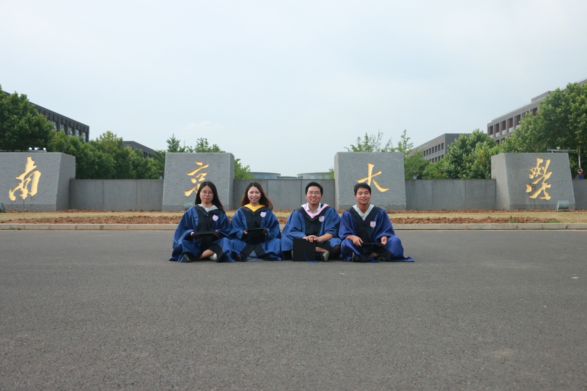
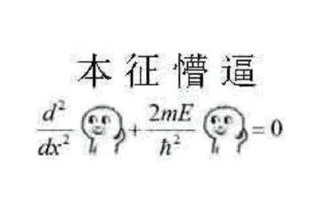
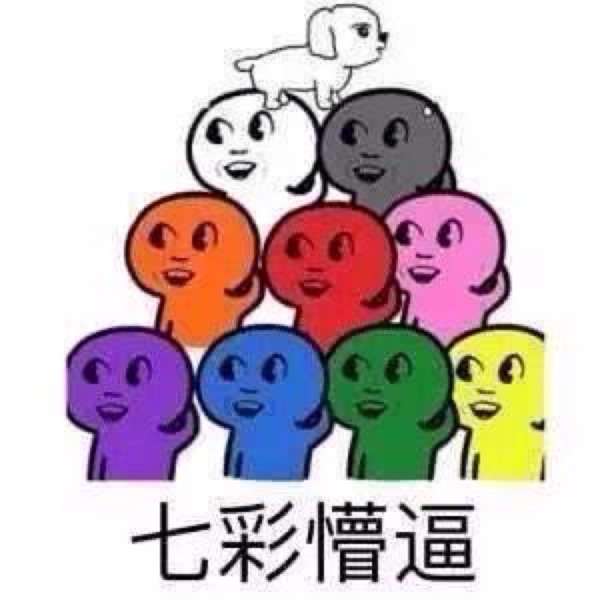
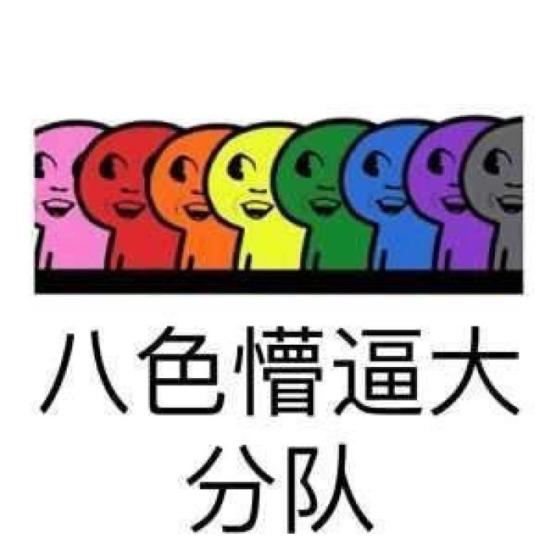
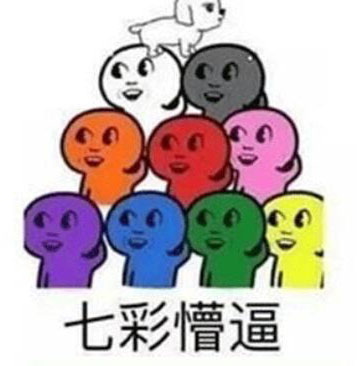
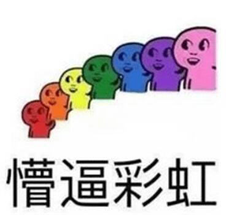

---?image=assets/img/qrcode.png&position=right 50% bottom 10%&size=10% auto
<h1 style="font-family:'Microsoft YaHei';">@color[#4876FF](我的)代表作</h1> 

Presented by @size[1.2em](@color[#4876FF](王小标))

---
## @fa[university](入职)
+++
@snap[north]
<h2>@size[0.5em](@color[#4876FF](入职)——Hello，贵阳院！)</h2>
@snapend
@snap[west sidebar]

@snap[midpoint]
@fa[angle-double-right fa-5x]
@snapend
@snapend
@snap[east sidebar]

@snapend

+++

@snap[north]
<h2>@size[0.5em](@color[#4876FF](入职)——Hello，贵阳院！)</h2>
@snapend
@snap[west sidebar]

@snap[midpoint]
@fa[angle-double-right fa-5x]
@snapend
@snapend
@snap[east sidebar]

@snapend

---

## @fa[male](工作)

+++

### 一脸茫然
@ul
- @fa[street-view](新环境)
- @fa[handshake-o](**新人际关系**)
- @fa[rocket](新技术)
- @fa[bicycle](新领域)
@ulend

@snap[east small]

@snapend
@snap[north small]

@snapend
@snap[west small]

@snapend
@snap[south small]

@snapend
@snap[south-west small]

@snapend
@snap[south-east small]

@snapend
@snap[north-east small]

@snapend
@snap[north-west small]

@snapend

+++

### 逐渐适应

+++
---?image=assets/img/lovework.jpg&position=left 10% bottom 10%&size=10% auto
---?image=assets/img/insist.jpg&position=right 10% bottom 10%&size=10% auto
@ul
- @size[0.5em](把项目资料打印装订好。)
- @fa[print]
- @size[0.5em](跟四个飞手一起去飞一下飞机。)
- @fa[plane]@fa[plane]
- @size[0.5em](日常简单的生产任务还是比较容易适应的。)
- @fa[hand-o-left]
- @size[0.5em](现在你对生产任务有一定了解啦。)
- @size[0.5em](你和黄瑞负责一下观山湖区三调监理项目。)
- @size[0.5em](你负责一下松桃“两区”划定项目。)
- @fa[hand-o-right]
- @color[#e49436](好吧，其实，我也不知道怎么适应的)
@ulend

+++

### 成果

+++

#### 二维GIS应用

+++

#### 三维GIS应用

+++ 

#### 无人机

+++

#### 其他

@ul
- @fa[code](标准GDB数据合并工具) 
- @fa[code](绘制断面Office Add-in工具)
- @fa[volleyball-ball](气排球)
- @fa[table-tennis](乒乓球(裁判))
- @fa[ellipsis-v]
@ulend

---?color=linear-gradient(to left, #56ccf2, #2f80ed)

## @fa[tint](生活)

+++?image=assets/images/music.png

### 音乐

@snap[south-west mid]

@snapend
@snap[south-east mid]

@snapend
@snap[north-east mid]

@snapend
@snap[north-west mid]

@snapend

+++?image=assets/images/dota2.jpg

@snap[north]
<h3>游戏</h3>
@snapend

+++?image=assets/images/css.jpg

### 学习

---

## Thanks