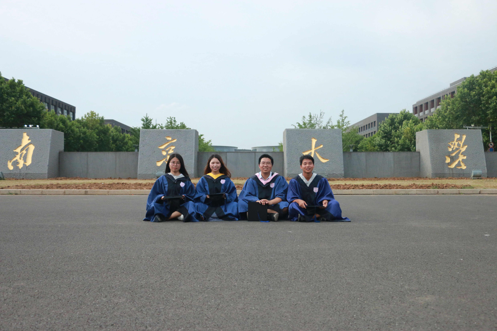

---?image=assets/img/qrcode.png&position=right 50% bottom 10%&size=10% auto
<h1 style="font-family:'STXingkai';">@color[#4876FF](我的)代表作</h1> 

Presented by @size[1.2em](@color[#4876FF](王小标))

---
## @fa[trian](入职)
+++
@snap[north]
<h2>@size[0.5em](@color[#4876FF](入职)——Hello，贵阳院！)</h2>
@snapend
@snap[west sidebar]

@snap[midpoint]
@fa[hand-o-right fa-5x]
@snapend
@snapend
@snap[east sidebar]SS

@snapend

+++

@snap[north]
<h2>@size[0.5em](@color[#4876FF](入职)——Hello，贵阳院！)</h2>
@snapend
@snap[west sidebar]

@snap[midpoint]
@fa[hand-o-right fa-5x]
@snapend
@snapend
@snap[east sidebar]

@snapend

---

## @fa[briefcase](工作)

+++

### 迷茫
@ul
- @fa[bus](@color[#e49436]陌生的环境)
- @fa[street-view](@color[#e49436]人际关系)
- @fa[comments](@color[#e49436]方言)
@ulend

@snap[east small]

@snapend
@snap[north small]

@snapend
@snap[west small]

@snapend
@snap[south small]

@snapend
@snap[south-west small]

@snapend
@snap[south-east small]

@snapend
@snap[north-east small]

@snapend
@snap[north-west small]

@snapend

+++

### 过渡

+++

@ul
- @size[0.5em](先假设你有一个苹果。)
- @fa[apple]
- @size[0.5em](假设有人又给了你另一个苹果。)
- @fa[apple]@fa[apple]
- @size[0.5em](现在，数一下你所拥有的苹果数量，你会得到结果是两个。也就是说一个苹果加一个苹果等于两个苹果，即一加一等于二。)
- $$1 + 1 = 2$$
- @size[0.5em](那么，现在你已经对算数的基本原理有了一定了解了，我们来看看下面这个例子，将上述知识运用到实践中。)
- $$\log 	\Pi(N) = (N + \frac{1}{2})\log N - N + A - \int_N^\infty{\frac{B1(x)dx}{x}}$$
- @color[#e49436](好吧，其实，我也不知道怎么缓过来的)
@ulend

+++

### 成果

+++

#### 二维GIS应用

+++

#### 三维GIS应用

+++ 

#### 无人机

+++

#### 其他

@ul
- @fa[code](标准GDB数据合并工具) 
- @fa[code](绘制断面Office Add-in工具)
- @fa[volleyball-ball](气排球)
- @fa[table-tennis](乒乓球(裁判))
- @fa[ellipsis-v]
@ulend

---?color=linear-gradient(to left, #56ccf2, #2f80ed)

## @fa[tint](生活)

+++?image=assets/images/music.png

### 音乐

@snap[south-west mid]

@snapend
@snap[south-east mid]

@snapend
@snap[north-east mid]

@snapend
@snap[north-west mid]

@snapend

+++?image=assets/images/dota2.jpg

@snap[north]
<h3>游戏</h3>
@snapend

+++?image=assets/images/css.jpg

### 学习

---

## Thanks